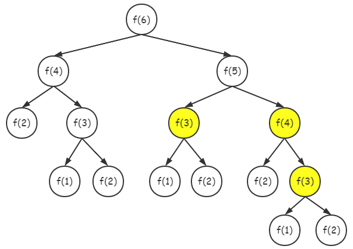
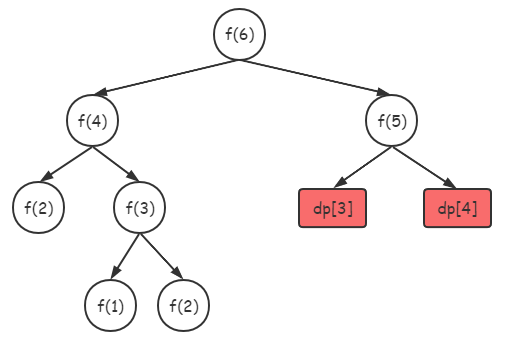
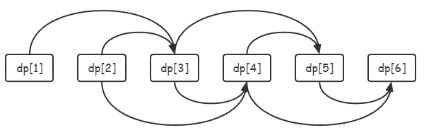

# DP

## 简介

动态规划（Dynamic programming, DP），是一种把原问题分解为相对简单的子问题再求解的方法，通常适用于有重叠子问题和最优子结构的问题。

具体而言，DP是先**将问题转换为可递归的子问题**，然后在求解子问题时，**将会被多次使用的结果保存起来，以减少重复计算**，最终达到**以空间换时间**的效果。

以斐波那契数列为例 `f(1)=1，f(2)=1, f(n)=f(n-1)+f(n-2)` ，这显然是一个递归问题。但在递归过程中，我们发现某些值总会被重复计算。如下图计算`f(6)`，在递归计算 `f(4)` 过程中 `f(3), f(4)` 的值都已得出，但在递归计算 `f(5)` 的过程中，`f(4)` 又被计算一次，`f(3)` 又被计算两次，显然这存在重复计算。



对此，我们可以将已计算过的结果保存在一个名为 `dp` 的备忘录数组中，`dp[i] = f(i)`。那么，在递归计算 `f(4)` 过程中，可以将已知结果的 `f(3), f(4)` 分别保存在 `dp[3], dp[4]` 中。最终，`f(6)` 计算过程可转换成下图所示，减少了大量的重复计算。



上述改进方法是动态规划的一种解题方式：**带备忘录的自顶向下的递归求解**，它还有另一种更常用的解题方式：**自底向上的动态规划**。根据斐波那契数列的定义，自底向上动态规划的状态转移方程为：`dp[1] = 1, dp[2] = 1, dp[i] = dp[i-1] + dp[i-2] (i > 2)`，可令i从1到6计算 `dp[i]`，最终算出 `dp[6]`。最终可得到一个拓扑排序后的顺序结构：



对于斐波拉契数列这种已知 **边界** 和 **递推关系（状态转移方程）** 的问题，可以轻松地使用DP方法求解。但对于大多数问题，并不会告诉我们这些，需要我们分析问题、找到规律、再确定边界与状态转移方程。而这就需要我们从大量题目中寻找经验。

## 经典案例

### 基础DP

#### 最长回文子串

定义 `dp[i][j]` 为 `[i,j]` 内的字符串是否为回文串，1代表是，0代表不是。

状态转移方程为：

```c
dp[i][j] = 1, i == j;
dp[i][j] = 1, i+1 == j && s[i] == s[j];
dp[i][j] = dp[i+1][j-1], j > i+1 && s[i] == s[j];
```

注意：由于 `dp[i][j] = dp[i+1][j-1]` ，这道题的递推方式不同于平常，i从后往前，j从前往后。

```c
for (int i = s_len-1; i >= 0; i--) {
    for (int j = i+1; j < s_len; j++) {
        ...
    }
}
```

代码：`exercise\leetcode\5最长回文子串.cpp`

#### 最长公共子序列

定义 `dp[i][j]` 表示 s1 的[0,i-1]区间与 s2 的[0,j-1]区间的最长公共子序列长度。

状态转移方程为：

```c
dp[i][j] == 0, i == 0 || j == 0;
dp[i][j] == dp[i-1][j-1] + 1, s1[i] == s2[j];
dp[i][j] == max(dp[i-1][j], dp[i][j-1]);
```

代码：`exercise\leetcode\1143最长公共子序列.cc`

### 数位DP

答案跟位有关系，且前i位的值与前i-1位的值存在关系，前i位的值会被重复使用。

#### 数码出现次数

输入两个正整数a,b，求在[a,b]（0 < a < b < 10^13）中的所有整数中，每个数码（0～9）各出现了多少次。

思路：

- 找规律：0~9、00~99、000~999中各数码出现的次数相等
- 问题简化：可将问题简化为求[a,b]中数码1出现的次数
- 区间拆分：[a,b]中数码1的次数可转换成：[0,b]中数码1的次数 - [0,a-1]中数码1的次数
- 分析状态转移方程：求[0,54321]中数码1的次数，`前5位中1的次数 = 0000~9999中1的次数 * 5（第5位是0~4时，前4位中1出现的次数） + 1*10000（10000~19999间第5位的1出现了共10000次）+ 0000~4321中1出现的次数`。

代码：

```c
#include <cstdio>
#include <cstring>
#include <cmath>

#define ll long long


ll digits[60]; // digits[i] 表示数值第i+1位上的数码
ll temp[60]; // temp[i] 表示数值前i位的值，比如：对于54321，temp[0]=0，temp[1]=1，temp[2]=21
ll dp[60]; // dp[i] 表示前i+1位内数码0~9的个数（每个位的数码上限都是9，且允许0的存在）。比如：dp[2]表示3位数（000~999）内各个数码的个数，由于在这范围内各数码对应的个数相同（比如数码0与数码1个数相同），所以只存一个值。

// 求前 p+1 位中，数码 x 的个数
// lim 表示当前位是否考虑上限，zero 表示是否有前导零（最高位到当前位都是0）
ll dfs(int p, int x, bool lim, bool zero) {
    if (p == -1) return 0;
    if (p == 0 && x == 0) return 1; // 前1位中，数码0的个数为1，直接返回
    if (!lim && !zero && dp[p] != -1) return dp[p]; // 不考虑上限和前导零的情况下，直接返回已记录的值
    int up = lim ? digits[p] : 9; // 考虑位上限则取上限，否则取9
    ll ans = 0;
    for (int i = 0; i <= up; i++) {
        if (i == 0 && zero) { // 存在前导零，且当前位为0，则之后也要考虑前导零
            ans += dfs(p-1, x, i == up && lim, true);
        } else if (i == up && lim) { // 到达上限，则之后的取值都要考虑上限
            // 若当前位的值i是目标数码x，则需加上之后位的总值，比如：43210，p=4，i=4，x=4，则4出现了3210次，再加上3210中4出现的次数
            if (i == x) ans += temp[p]+1;
            ans += dfs(p-1, x, true, false);
        } else { // 没有上限
            if (i == x) ans += pow(10, p);
            ans += dfs(p-1, x, false, false);
        }
    }
    if (!lim && !zero) dp[p] = ans;
    return ans;
}

void solve(ll n, ll *res) {
    if (n < 0) return;
    if (n == 0) {
        res[0] = 1;
        return;
    }
    memset(digits, 0, sizeof(digits));
    memset(temp, 0, sizeof(temp));
    memset(dp, -1, sizeof(dp));
    int p = 0;
    while (n) {
        digits[p] = n%10;
        if (p > 0) temp[p] = digits[p-1] * pow(10, p-1) + temp[p-1];
        printf("%d %lld\n", p, temp[p]);
        p++;
        n /= 10;
    }
    for (int i = 0; i < 10; i++) res[i] = dfs(p-1, i, true, true);
}

int main() {
    ll a, b;
    scanf("%lld %lld", &a, &b);
    ll res_a[10], res_b[10];
    memset(res_a, 0, sizeof(res_a));
    memset(res_b, 0, sizeof(res_b));
    solve(a-1, res_a);
    solve(b, res_b);
    printf("%lld", res_b[0]-res_a[0]);
    for (int i = 1; i < 10; i++) printf(" %lld", res_b[i]-res_a[i]);
}
```
