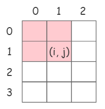
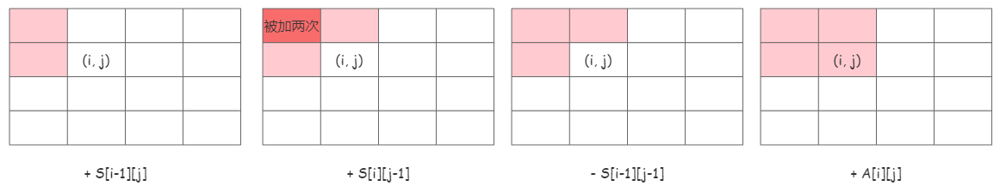
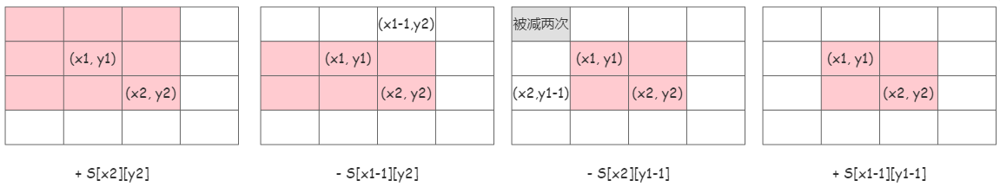
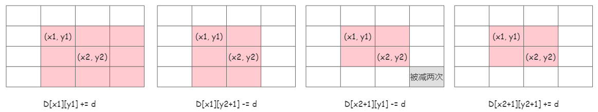

# 前缀和 + 差分

参考：

- [https://zhuanlan.zhihu.com/p/436526162](https://zhuanlan.zhihu.com/p/436526162)
- [https://zhuanlan.zhihu.com/p/439268614](https://zhuanlan.zhihu.com/p/439268614)

## 前缀和

对于数组A，位置i的前缀和，是数组前i个数的和。因此，前缀和数组S，有 `S[i] = A[0]+A[1]+...+A[i]` 。

构建前缀和数组：

```c++
S[0] = A[0];
S[i] = S[i-1] + A[i];
```

前缀和数组可用于**求任意区间和**。计算数组A中区间 `[l,r]` 之间数的和：`S[r]-S[l-1]`。

## 二维前缀和



对于二维数组A，位置(i,j)的前缀和，是二维数组中以(0,0)为左上角、(i,j)为右下角的矩阵区域中，所有数的和。因此，对于二维前缀和数组S：

$$S[i][j] = \sum_{x=0}^i \sum_{y=0}^j A[x][y]$$

构建二维前缀和数组：

```c++
S[0][0] = 0;
S[0][j] = S[0][j-1] + A[0][j];
S[i][0] = S[i-1][0] + A[i][0];
S[i][j] = S[i-1][j] + S[i][j-1] - S[i-1][j-1] + A[i][j];
```

注：`S[i-1][j-1]` 是 `S[i-1][j]` 与 `S[i][j-1]` 的重叠部分，相当于加了2次，需减去1次（**容斥原理**）。如下图（浅色区域表示已计算部分，深色区域表示重复计算部分）：



二维前缀和数组可用于**计算任意矩形区域内数的和**。计算原数组中以(x1,y1)为左上角、(x2,y2)为右下角的矩形区域内数的和，公式为：

```c++
S[x2][y2] - S[x1-1][y2] - S[x2][y1-1] + S[x1-1][y1-1]
```

同样， `S[x1-1][y1-1]` 是 `S[x1-1][y2]` 和 `S[x2][y1-1]` 的重叠部分，相当于减了2次，需加1次。



## 差分

对于数组A，存在差分数组D：`D[0] = A[0]; D[i] = A[i]-A[i-1]`。

根据差分数组，可通过前缀和求出原数组，即：`A[0] = D[0]; A[i] = A[i-1]+D[i]`。不难发现，差分与前缀和是**逆运算**：差分数组D的前缀和数组是原数组A，前缀和数组S的差分数组也是原数组A。

差分数组可以用于**快速对任意区间内的数加上一个值d**。比如：对区间`[l,r]`内的数都加上d。如果按照正常方法，需要遍历区间所有元素，时间复杂度为`O(r-l)`。但如果事先得到差分数组，可以在`O(1)`内解决，即：`D[l] = D[l]+d, D[r+1] = D[r+1]-d`。

解释：将差分数组中位置 i 的数加上 d，相当于原数组 i 到 n 的数都加上 d。因此，`D[l]+d`相当于原数组 l 到 n 都加上 d，而 `D[r+1]-d` 相当于原数组 r+1 到 n 都减去 d，最终原数组只有 l 到 r 的数加上 d。

## 二维差分

对于二维数组A，其二维差分数组D的定义为：`D[i][j] = A[i][j] - A[i-1][j] - A[i][j-1] + A[i-1][j-1]`。

前面提到，前缀和与差分是逆运算，二维差分数组的前缀和数组等于原数组，即A是D的前缀和数组。上述二位差分数组的定义，其实就是**用前缀和数组 A 求 D 中以 (i,j) 为左上角、(i,j) 为右下角这个区域内数的和，即 `D[i][j]` 的值**。

二维差分数组可用于**快速对任意矩形区域内的数都加上d**。将原数组中以(x1,y1)为左上角、(x2,y2)为右下角的矩形区域内的数都加上d，公式为：

```c++
D[x1][y1] += d
D[x1][y2+1] -= d
D[x2+1][y1] -= d
D[x2+1][y2+1] += d
```

解释：`D[i][j]`加上 d，等价于原数组中 `A[i][j]` 到 `A[n][m]` 矩形区域的数都加上 d。因此，根据公式，原数组变化过程如下图（粉色区域表示+d，灰色区域表示-2d）：


