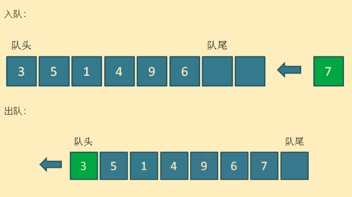

# Queue

## 1. 概述



**先进先出**的数据结构。

存储方式：

- 链表
- 数组

## 2. 扩展

### 双向队列

队头和队尾都可以插入`push`和删除`pop`。

### 优先队列

入队操作不变，出队时，弹出优先级最高（比如值最大）的元素。

内部用**堆**实现，堆的详细介绍见 [tree\README.md](..\tree\README.md)

## 3. 经典案例

### 用队列实现栈

思路：

两个队列。入栈时，将元素压入其中一个不为空的队列；出栈时，将 `n-1` 个元素从不为空的队列中弹出，并压入另一个空队列中，最后弹出剩下的第 `n` 个元素，即栈顶元素；通过一个 `top` 变量记录栈顶元素，获取栈顶元素时，直接返回 `top` 变量。

示例：[leetcode-225-用队列实现栈](../../../exercise/leetcode/225用队列实现栈.cc)

### 滑动窗口的最大值 - 双向队列 + 单调队列

题目：[leetcode - 239 - 滑动窗口最大值](https://leetcode-cn.com/problems/sliding-window-maximum/)

思路：

由于窗口是滑动的，所以某次窗口内的最大值，最终会被抛弃在窗口之外，此时就需要扶持原本的第二大值上位了。

那么如何快速地找到第二大值呢？我们可能会想到**单调栈**，但栈并不能快速地删除最大值（即栈底元素）。

此时，我们就需要使用双向队列了。队列保存数组下标，并且队头下标对应的值为窗口内的最大值，**队头到队尾下标对应的值满足单调递减**。

同时，需要判断队头对应的最大值是否被当前窗口抛弃。

```e
 滑动窗口的位置                 双向队列
---------------               ---------
[1  3  -1] -3  5  3  6  7     [3 -1]
 1 [3  -1  -3] 5  3  6  7     [3 -1 -3]
 1  3 [-1  -3  5] 3  6  7     [5]
 1  3  -1 [-3  5  3] 6  7     [5 3]
 1  3  -1  -3 [5  3  6] 7     [6]
 1  3  -1  -3  5 [3  6  7]    [7]
```

示例：[leetcode-239-滑动窗口最大值](../../../exercise/leetcode/239滑动窗口最大值.cc)
