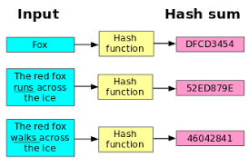
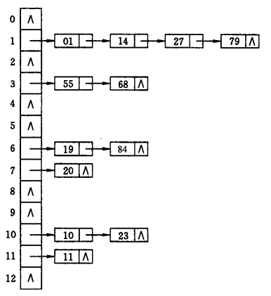

# 散列表 / 哈希表 / Hash Table

查找是现实中出现频率相当高的行为。为了准确查找，通常需要知道被查找东西的`key`（唯一的标识），比如书的书名、人的名字、身份证等等，才能找到对应的数据 `value` 。

查找一直是算法中需要解决的一个大问题，许多数据结构与算法的设计都是为提高查找效率，比如：二叉查找树、红黑树、二分查找等等。在乱序的数组、链表等线性结构中，查找的时间复杂度为 O(n) 。而在二叉查找树等树形结构中，查找的时间复杂度可减小至 O(logn) 。但是，欲望总是无穷，人们还想在 O(1) 的时间内完成查找。就像数组一样，只要给出数组的下标`key`，就可以在 O(1) 内找到下标对应的数据`value`。

**散列表 / 哈希表 / Hash Table**是一种期望在 O(1) 时间内完成查找的数据结构。散列表使用数组进行存储，它通过数据的标识 key 直接索引数据对应的值 value 。当然，数据的 key 并不像数组的下标那般有规律，通常是断续且不定长的，比如书名。而数组的存储是连续且有限的，因此需要对 key 进行转换，转换的过程则是由散列表的核心——哈希函数完成。

**哈希(Hash)函数**，又称散列函数，是将**任意长度**的输入 `x` 通过哈希计算，得到**固定长度**哈希值 `H(x)` 的过程。优秀的哈希函数具有**不可逆性**，即根据输出 `H(x)` 无法高效地推出输入 `x` 。

由于哈希函数定义域（输入x的范围）是无限的，而值域（输出y的范围）是有限的，理论上会出现**哈希碰撞**：对于 `x != y` ，存在 `H(x) = H(y)` 。但是，优秀的哈希函数，出现哈希碰撞的概率几乎为0 ，即：若 `x != y` ，则 `H(x) != H(y)` 。

综上，优秀的哈希函数具有**不可逆**和**碰撞抵抗**的特性，比如：MD5、SHA-256都是当下优秀的哈希函数（MD5已被中国的王小云院士破解，被证明可以产生碰撞）。这些优秀的哈希函数可用于**完整性校验**、**数据摘要**等等。

在一般的散列表设计中，通常不会使用SHA-256这类哈希函数，原因是**越安全越优秀的哈希函数，计算速度也越慢**。因此，在散列表中，哈希碰撞总会出现。对此，常用的解决方法如下：

- 链地址法：key 相同的用链表链接在其后
  
- 开放定址法：
  - 线性探测法：key 相同 -> 放到 key 的下一个位置，`Hi(key) = (H(key) + i) mod m`
  - 随机探测法：`Hi(key) = (H(key) + 伪随机数) mod m`
- 再哈希：冲突则再进行一次哈希 `Hi(key) = H(H(key))`
- 公共溢出区：将冲突的 key 放入溢出区中
