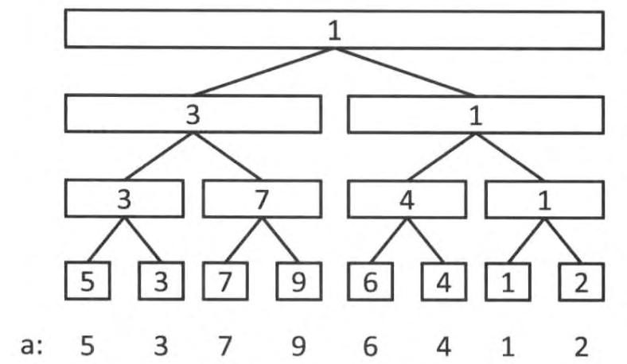

# 线段树(Segment Tree)

在O(1)时间内，求区间内所有数的和，可用前缀和数组；在O(1)时间内，将区间内所有数都加上一个数，可用差分数组。

但如果**既要高效对区间进行查询（找最大值、求和），又要高效对区间进行修改（都加上一个数）**，就不太适合用前缀和或差分数组，而更适合用线段树。

线段树是一种用数组存储的树形数据结构，区间查询的时间复杂度为`O(log)`，区间修改的时间复杂度也为`O(log)`。

顾名思义，线段树是一棵树，同时它还是一棵**完全二叉树**。对于完全二叉树，可用**数组存储，第`p(p>=1)`个结点的左孩子下标为`2*p`，右孩子下标为`2*p+1`**。

在线段树中，一个结点代表一个区间`[l,r]`，结点的左右孩子分别代表该区间**二分**之后的左右子区间。令`mid = (l+r)/2`，左孩子代表区间`[l,mid]`，右孩子代表区间`[mid+1,r]`。根结点为最大区间，叶子结点为不可再分的只有一个值的子区间。

**线段树结点的值，可以是想要查询或统计的值**，比如区间`[l,r]`内的最大值、区间`[l,r]`内数的和。

对于一个长度为7的数组`[5,3,7,9,6,4,1,2]`，要统计区间内的最小值，其线段树如下。根结点代表区间`[0,7]`，其值为区间内最小值1。根结点左孩子代表区间`[0,3]`，其值为区间内最小值3。根结点右孩子代表区间`[4,7]`，其值为区间内最小值1。以此类推。



## 创建

对于长度为7的数组A，统计区间内的最小值，创建线段树代码如下：

```c++
// 用数组存储线段树。
// 线段树是完全二叉树，总结点数约为叶子层结点数的2倍，而叶子层结点数等于len(A)，因此总结点数约为2*len(A)。此处开4倍，是为了不容易越界。
int tree[7*4];

void init(int p, int l, int r) {
    if (l == r) {
        // 区间只有一个值，那最小值就等于该值
        tree[p] = A[l];
    } else {
        // 二分划分左右子区间，再创建子区间，最后取左右子区间中的最小值
        int mid = (l+r) / 2;
        init(2*p, l, mid);
        init(2*p+1, mid+1, r);
        tree[p] = min(tree[2*p], tree[2*p+1]);
    }
}

init(1, 0, 6); // p>=1。若p从0开始，左右孩子则为2p+1、2p+2
```

## 查询

查询区间`[a,b]`内的最小值：

```c++
int query(int a, int b, int p, int l, int r) {
    // [a,b]与[l,r]不相交，返回一个极大值
    if (a > r || b < l) return INT_MAX;

    // [a,b]包含[l,r]，返回[l,r]区间最小值
    if (a <= l && r <= b) return tree[p];

    // [a,b]与[l,r]相交，返回左右子区间的最小值
    int mid = (l+r) / 2;
    int vl = query(a, b, 2*p, l, mid);
    int vr = query(a, b, 2*p+1, mid+1, r);
    return min(vl, vr);
}
```

## 修改

### 单点修改

修改数组中第`k(k>=1)`个位置的值：

```c++
void update(int k, int v) {
    k += n-1; // 对应的线段树叶子结点，在线段树数组中的位置
    tree[k] = v;
    // 向上传递
    while (k >= 1) {
        k = k/2;
        tree[k] = min(tree[2*k], tree[2*k+1]);
    }
}
```

### 区间修改

区间修改需要引入一个“懒标记”，具体参考：[https://zhuanlan.zhihu.com/p/106118909](https://zhuanlan.zhihu.com/p/106118909)。
