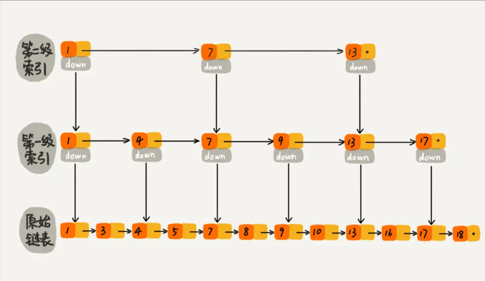
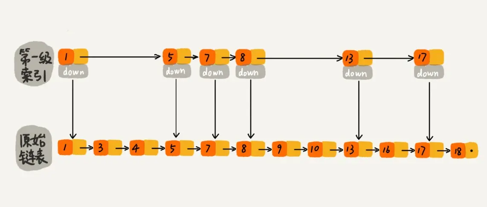
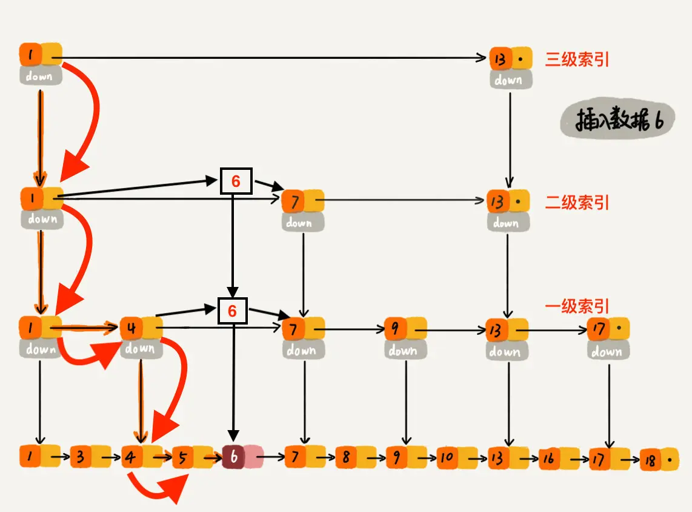

# 跳表

参考：[Skip List--跳表（全网最详细的跳表文章没有之一）](https://www.jianshu.com/p/9d8296562806)

跳表是一种查询、插入、删除的时间复杂度都是 `O(logn)` 的结构，可与红黑树相互匹敌。

跳表应用在许多 LSM(Log Structured Merge) 结构的数据库中，比如：LevelDB、RocksDB、HBase等。以 LevelDB 为例，它内部的 MemTable 即使用的跳表结构。

## 基本结构

理想的跳表结构如上。

最底层是原始链表，是一个普通的链表结构，节点保存了**数据的值和索引**。原始链表之上，是一层层的索引。

每一层中，每两个元素会选出一个作为索引，被提到上一层索引中。在这种结构体中，索引节点的总数为 `n/2 + n/4 + ... ≈ n`，因此**空间复杂度为 `O(n)`** 。

同时，假设索引的层数为 `h` ，则 `2^h = n` ，可推算出 `h = logn` ，类似于二叉树。

但为了降低跳表的插入时间复杂度，实际的跳表结构如下。每一层会随机选择 `k/2` 个元素（k为当前层元素个数），形成上一层的索引。**当数据量足够大，且抽取足够随机的话，形成的上一层索引是均匀的**，即接近于理想结构。

## 查询

跳表的查询，从最上层索引开始，一层一层遍历，直到原始链表。

由于在理想结构中，每层的每两个元素，就会选出一个作为上一层的索引。因此，这种遍历方式只需要遍历 `logn` 层，每次遍历 1~3 个元素，时间复杂度为 `O(logn)` 。

## 插入

插入数据，需要在原始链表中插入对应的新节点。因为需要满足上一层索引节点个数是下一层的 `k/2` ，当新节点插入后，同时也需要更新索引。那跳表中**更新索引的规则**是怎样的呢？

一种简单的方法是，插入之后重建索引，但这样的时间复杂度为 `O(n)` 。有没有更加高效的方法呢？有的。

首先，我们需要知道，从每一层中随机选取 `k/2` 个元素作为上一层索引，也能保证查询的时间复杂度为 `O(logn)` 。因为，当**数据量足够大时，随机选择的上一层索引是均匀分布的**。

因此，我们可以从原始链表中随机选择 n/2 个元素所为一级索引，从一级索引中随机选择 n/4 个元素作为二级索引，......，直到顶层索引。注意：**当元素作为 `i` 级索引时，它同时也是 `i-1` 级中的索引**。

根据上述的随机选择方法，原始链表中，**每个元素有 1/2 的概率成为一级索引，1/4的概率成为二级索引，......**。

在具体实现中，当每次插入数据时，通过一个概率算法函数 `randomLevel()` 告诉我们这个元素是几级索引。该函数有 1/2 概率返回 1 ，表示元素只需存在原始链表中；有 1/4 概率返回 2 ，表示元素是一级索引；1/8 返回 3 ，表示是二级索引；......。

基于 `randomLevel()` 函数的返回，一个元素是一级索引的概率为 **randomLevel() > 1 的概率**，即 `1 - [randomLevel() == 1 的概率] = 1 - 1/2 = 1/2`；而是二级索引的概率为 **randomLevel() > 2 的概率**，即 `1 - [randomLevel() == 1 的概率] - [randomLevel() == 2 的概率] = 1 - 1/2 - 1/4 = 1/8` 。这满足前面所提到的随机选择方法的要求。

示例如下，插入元素 6 ，randomLevel() 返回 3 ，即元素为二级索引。

通过上述方法，插入的时间复杂度等于查询的时间复杂度，`O(logn)`。

## 删除

删除相对简单一点，只需要找到元素，并将其所对应的索引一起删除即可，时间复杂度为 `O(logn)` 。

