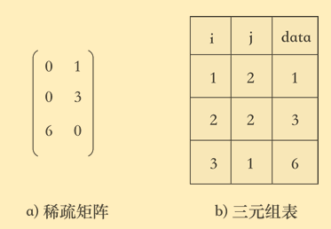

# 矩阵的快速转置

## 用三元组表示稀疏矩阵

为了节省空间，通常用三元组存储稀疏矩阵。

三元组是包含三个属性的结构体，分别是：行号、列号、对应位置的值。

示例如下：



## 稀疏矩阵的快速转置

目标：将稀疏矩阵`T`转置为稀疏矩阵`M`，都是用三元组表示。

思路：

1. 定义一个数组`num`，该数组`i`位置记录，转置之后稀疏矩阵`M`第`i`行元素的个数。由于`T`中元素的列对应`M`中的行，则通过遍历`T`的三元组，对每个元素的列值`k`，`num[k]++`即可。

2. 定义一个数组`cpot`，该数组`i`位置记录，稀疏矩阵`M`第`i`行第一个元素，在`M`三元组中的位置。例如：第一行第一个元素在`M`三元组中的位置是`0`，第二行第一个元素的位置则是 `cpot[1]+num[1]`，即第一行第一个元素的位置加上第一行元素的个数。以此类推，得出数组cpot。

3. 开始转置。遍历`T`的三元组，根据每个元素的列值`k`，通过`cpot[k]`，可以得到它在`M`三元组中的位置。然后`cpot[k]++`，这样便可以知道：`T`中该列的下一个元素，在`M`三元组中的位置。

代码：

```cc
/*
矩阵转置，快速转置
矩阵的行数、列数和非零元个数：
5 5 10
非零元素的行号、列号和值：
1 2 3
1 3 3
2 2 2
2 4 4
2 5 4
3 1 3
3 5 5
4 1 2
4 3 2
5 5 5
*/
#include<stdio.h>
#include<stdlib.h>

typedef struct{
    int data[100][3];
    int row, col, num; // 行数，列数，非零个数
}TSMatrix;

int main() {

    TSMatrix T; // 转置前的矩阵(三元组)
    printf("请输入矩阵的行数、列数和非零元个数：");
    scanf("%d%d%d", &T.row, &T.col, &T.num);

    printf("请输入依次矩阵中非零元素的行号、列号和值：\n");
    for(int i=0; i<T.num; i++) {
        scanf("%d%d%d", &T.data[i][0], &T.data[i][1], &T.data[i][2]);
    }

    // 转置之后的矩阵(三元组)
    TSMatrix M;
    M.col = T.row;
    M.row = T.col;
    M.num = T.num;

    // 初始化num数组
    int *num = (int*)malloc(sizeof(int)*(M.row+1));
    for(int i=0; i<=M.row; i++) num[i] = 0;

    // 初始化cpot数组
    int *cpot = (int*)malloc(sizeof(int)*(M.row+1));
    for(int i=0; i<=M.row; i++) cpot[i] = 0;

    // 记录转置之后M矩阵每一行有多少个元素
    // T矩阵的列便对应M矩阵的行
    for(int i=0; i<T.num; i++) {
        num[T.data[i][1]]++;// 将M矩阵那一行元素个数加一
    }

    // 计算cpot数组，即M矩阵中每一行在三元组中开始的位置
    for(int i=2; i<=M.row; i++) {
        cpot[i] = cpot[i-1] + num[i-1];// 当前行开始的位置 = 上一行开始的位置 + 上一行元素个数
    }

    // 开始将T转置成M
    for(int i=0; i<T.num; i++) {
        int pos = cpot[T.data[i][1]];   // 通过cpot数组得出该列的这个元素在转置之后三元组中的位置
        cpot[T.data[i][1]]++;           // ++后便是该列的下一个元素所在三元组的位置
        M.data[pos][0] = T.data[i][1];  // 列值赋给行值
        M.data[pos][1] = T.data[i][0];  // 行值赋给列值
        M.data[pos][2] = T.data[i][2];
    }

    printf("\n========转置之后========\n");
    for(int i=0; i<M.num; i++) {
        printf("%d %d %d\n", M.data[i][0], M.data[i][1], M.data[i][2]);
    }

    free(num);
    free(cpot);
}
```
