# Graph

## 1. 概述

图是一种比树更复杂的非线性结构。

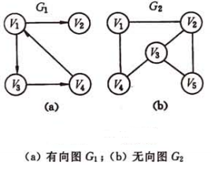

- 通过一条边相连的两个点称为**邻接点**。
- 顶点的**度**是跟顶点相关联的边的数目。
- 有向图中，以顶点为终点的边的数目称为顶点的**入度**；以顶点为起点的边的数目称为顶点的**出度**。
- 无向图中，如果顶点 v1 到顶点 v2 存在路径，则 v1 和 v2 **连通**。如果任意两点都连通，则称为**连通图**。
- 一个连通图的**生成树**是一个极小连通图，它包含图中所有顶点，但只有构成一棵树的 n-1 条边。

图的存储：

- 二维数组：
  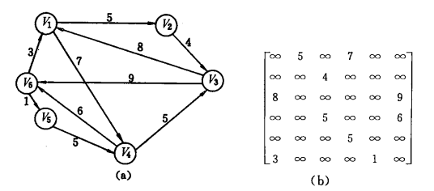
- 邻接表（数组+链表），下图分别对应 G1 和 G2 ：
  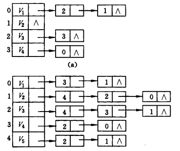

图的遍历：

- DFS 深度优先：栈/递归
- BFS 广度优先：队列

## 2. 扩展

### 2.1. 最小生成树

最小生成树，又称最小代价生成树。常用于有权图中，是指一棵的权值和最小的生成树。

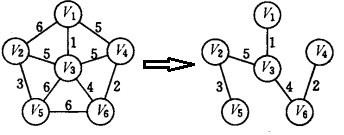

#### 克鲁斯卡尔 Kruskal

Kruskal 克鲁斯卡尔，又称**避圈法**求最小生成树，常用于稀疏图（边较少）。

**并查集（Disjoint-set data structure）** 是 Kruskal 算法的关键，它的详细介绍见 [others\并查集.md](..\others\并查集.md) 。

Kruskal 的求解过程为：

1. 定义一个新的图 G ，包含原图所有顶点，但不包含边；定义一个并查集数组，包含图中所有顶点，初始所有结点自成集合；

2. 对原图中的边按权重从小到大排序（快排）；

3. 从小到大遍历排好序的边：
    - 若当前边的两个端点在新图 G 中连通（用**并查集**判断两个点是否属于同一集合），则说明当前边会与 G 中的边构成圈，跳过该边；
    - 反之，将当前边添加到 G 中，并将边的两个端点所在的集合合并。

4. 当 V 中边数达到 `n-1` 时，遍历终止。

示例：

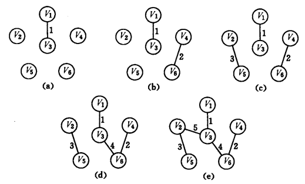

简略伪代码如下：

```c++
// C++

// 并查集查询函数
int find(int *fa, int n) {
    return n == fa[n] ? n : fa[n] = find(fa, fa[n]);
}

Graph kruskal(Graph G) {
    // 初始化新图，包含原图所有顶点但不包含边
    Graph newG;
    ...

    // 将原图的边拷贝到 edges 数组中
    Edge edges[G.m];
    ...

    // 初始化并查集
    int fa[G.n];
    for (int i = 0; i < G.n; ++i)
        fa[i] = i;

    // 对m条边，进行快速排序
    sort(edges);

    for (int i = 0; i < G.m; i++) {
        // 找到边起点所在的集合
        int x = find(edges[i].from);
        // 找到边终点所在的集合
        int y = find(edges[i].to);
        // 如果两个集合不相等，则说明两点不连通
        if (x != y) {
            // 将两个点所在集合合并
            fa[x] = y;
            // 将边添加到新图中
            ...
        }
    }

    return newG;
}
```

#### 普里姆 Prim

Prim 算法思想与下文中 Dijkstra 算法思想相似，在此不赘述。

### 2.2. 最短路径

#### 迪杰斯特拉 Dijkstra

迪杰斯特拉算法，用于解决 “**给定起始点**到其余点的最短路径” 问题，即**单源最短路径算法**。时间复杂度为 $O(n^2)$。其本质是**贪心**。

算法步骤为：

1. 用 `G[n][n]` 二维数组记录图数据；定义 `dis[n]` 一维数组记录起始点到各点的最短路径，初始化为 `INF`（可以是 int 的最大值）；`visited[n]` 一维数组记录该点是否给访问过（“访问过”表示已找到最短路径），初始化为 `false`。
2. 选择起始点 `s` ，令 `dis[s] = 0`。
3. 进行 `n` 次循环：
    1. 先从 `dis[n]` 数组的所有未访问结点中，找出最小值，并记录对应下标 `p` ，令 `visited[p] = true`。
    2. 更新 `p` 所有邻接点在 `dis[n]` 数组中的值，更新规则为：`dis[i] = min{dis[i], dis[p]+G[p][i]}`

示例及图解：

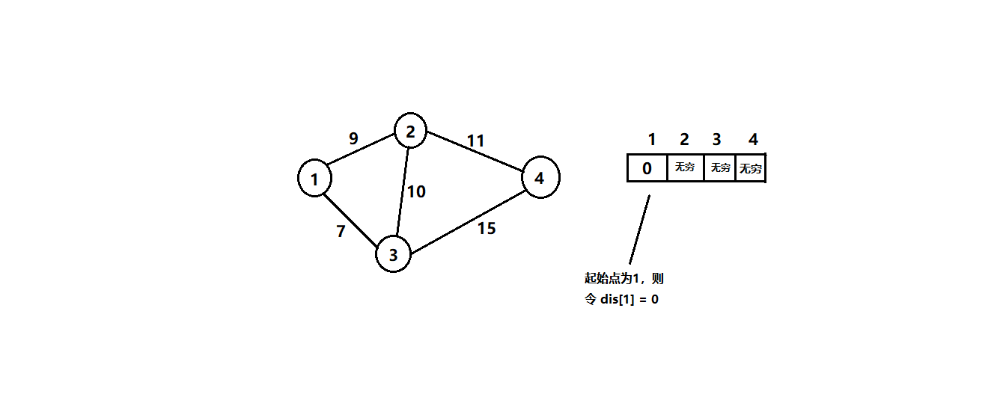
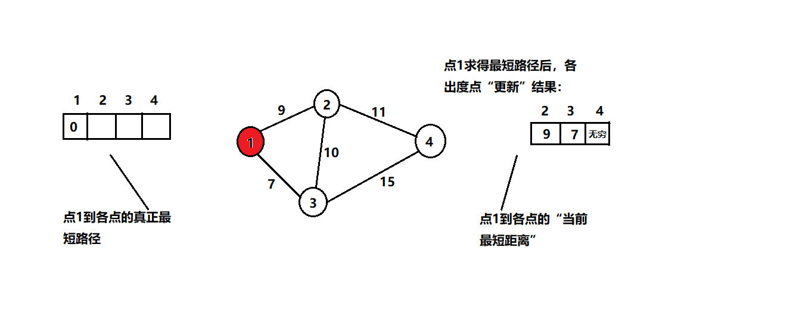
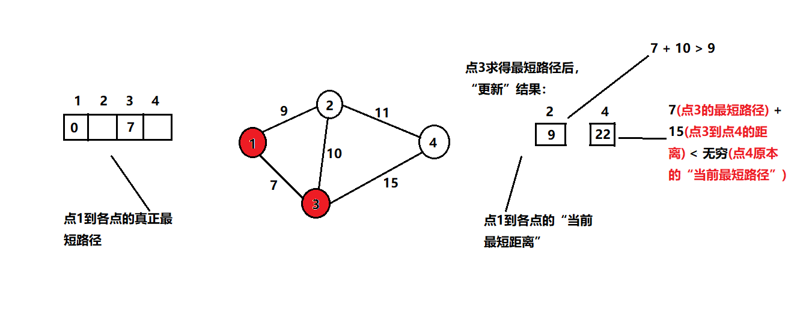
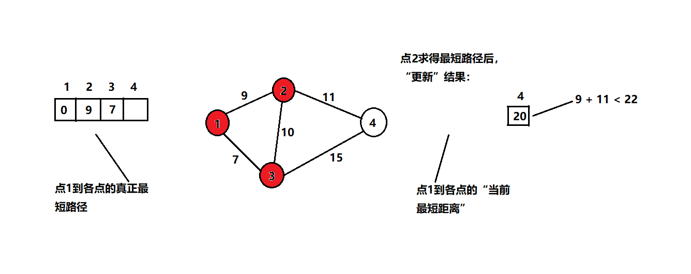
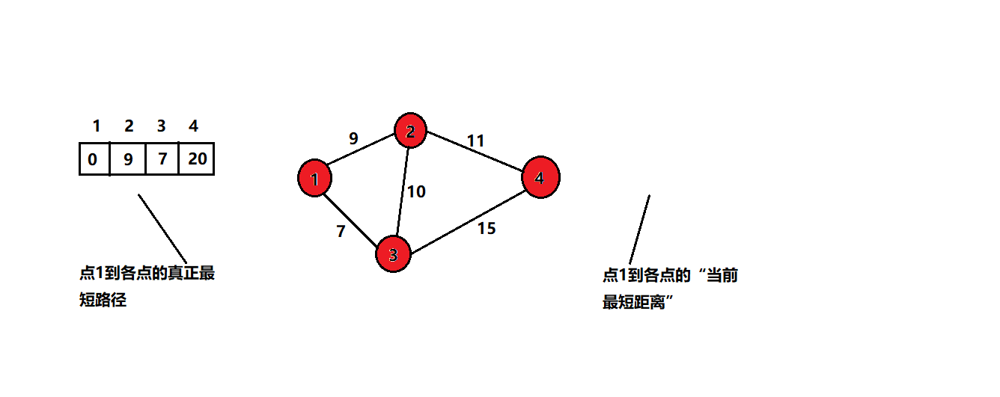

核心伪代码如下：

```c
int dis[n];
bool visited[n];
for (int i = 0; i < n; i++) {
    dis[i] = INF;
    visited[i] = false;
}

dis[s] = 0;
for (int j = 0; j < n; j++) {
    // 找 dis 数组中的最小值
    int p = -1, min = INF;
    for (int i = 0; i < n; i++) {
        if (visited[i] == false && dis[i] < min) {
            p = i;
            min = dis[i];
        }
    }
    visited[p] = true;

    // 更新最小值所有邻接点的值
    for (int i = 0; i < n; i++) {
        if (G[p][i] == INF || visited[i]) continue;
        if (dis[i] > dis[p]+G[p][i]) {
            dis[i] = dis[p] + G[p][i];
        }
    }
}
```

#### 弗洛伊德 Floyd

弗洛伊德是求解图中**任意两点间**最短路径的算法。时间复杂度为 $O(n^3)$。其本质是**动态规划**。

算法步骤为：

1. 任意两点间的最短距离用 `d(x,y)` 表示，初始值为两点相连边的权重。

2. 遍历所有点 k，若任意两点 i 和 j，满足 `d(i,j) > d(i,k) + d(k,j)`，则 `d(i,j) = d(i,k) + d(k,j)`。

代码如下：

```c
for (k = 1; k <= n; k++) {
    for (i = 1; i <= n; i++) {
        for (j = 1; j <= n; j++) {
            if (d[i][j] > d[i][k] + d[k][j]) {
                d[i][j] = d[i][k] + d[k][j];
            }
        }
    }
}
```

算法分析：Floyd 的核心思想是**动态规划**。

1. 我们先定义状态：`d[k][i][j]`，它表示经过前 k 个节点，点 i 到点 j 的最短路径。

2. `d[k][i][j]` 可以由 `d[k-1][i][j]` 转移而来：
    - 假设已经求出，经过前 k-1 个节点，任意两点间的最短路径。
    - 那么，`d[k][i][j]` 就是 **经过前 k-1 个节点 i 到 j 最短路径** 与 **经过第 k 个节点 i 到 j 最短路径** 中的最小值。
    - 而经过第 k 个节点 i 到 j 最短路径，就是 i 到 k 的最短路径加上 k 到 j 的最短路径。
    - 最终，得出状态转移方程为：`d[k][i][j] = min{d[k-1][i][j], d[k-1][i][k] + d[k-1][k][j]}`。

3. 由于 `d[k][x][x]` 的状态仅由 `d[k-1][x][x]` 转移而来，所以我们可以进行优化：`d[i][j] = min{d[i][j], d[i][k] + d[k][j]}`。

#### 贝尔曼-福特 Bellman-Ford

贝尔曼-福特算法，也是一个**单源最短路径算法**，同时它还能**处理负权边**。算法时间复杂度为 $O(NE)$，$N$ 是点的个数，$E$ 是边的个数。

算法步骤：

1. 令源点为 `s` ，源点到任意点 `x` 的最短距离用 `d(x)` 表示。`d(s)` 初始值为0，其余初始值为无穷。

2. 进行 $N-1$ 次松弛操作，松弛操作即：遍历所有边，对于每一条边 `e(i,j)` ，如果存在 `d(j) > d(i) + e(i,j)` ，则令 `d(j) = d(i) + e(i,j)`。

代码如下：

```c
for (i = 0; i < n-1; i++) {
    for (j = 0; j < E; j++) {
        if (d(e[j].to) > d(e[j].from) + e[j]) {
            d(e[j].to) = d(e[j].from) + e[j];
        }
    }
}
```

算法分析：松弛操作的过程十分神奇，直觉告诉我它肯定是正确的，但具体原因我也是一头雾水。不过，我们可以知道，**每次松弛操作后，至少能确定一个点的最短路径**。所以，需要进行 $N-1$ 次。

Bellman-Ford 如何解决 Dijkstra 不能解决的负权边问题呢？如下图，源点为 1 。若在 Dijkstra 中，会先确定源点到点 3 的最短距离为 1 ，第二次大循环 1 是 `dis[]` 数组中的最小值；而在 Bellman-Ford 中，经过松弛操作便可以确定源点到点 3 的最短距离为 -1 。

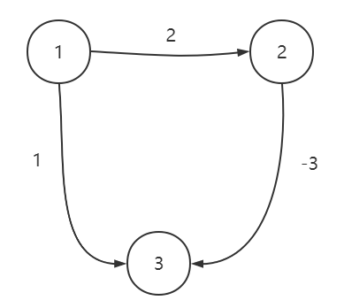

Bellman-Ford 算法虽然能解决负权边的问题，但时间复杂度还是偏高，当用于稠密图时，性能是无法接受的。

因此，有人提出了 Bellman-Ford 的优化算法：**SPFA**。即**第一次松弛操作，只需要对源点的邻接边进行即可；第二次松弛操作，只需要对与这些边相连点的邻接边进行即可；以此类推，直至所有边遍历完**。这类似于 BSF 。

参考：

- [【原创】算法系列——四种最短路算法：Floyd，Dijkstra，Bellman-Ford，SPFA](https://zhuanlan.zhihu.com/p/33162490)

### 2.3. 拓扑排序

拓扑排序是求出有向无环图（DAG）中所有顶点的线性序列，满足：

- 每个顶点只出现一次。
- 序列中前一个顶点能直达后一个顶点。

拓扑排序过程如下：

1. 定义一个数组，下标代表顶点的序号，值代表每个顶点的入度值。

2. 将入度为 0 的顶点取出，放入结果序列的最后，并将相邻边的出度点的入度值减 1 。不断循环，直至数组中无入度为 0 的顶点。

3. 如果最后数组中还存在入度不为 0 的点，则表明该有向图中存在环。

示例如下，最后得到的序列为：`v6, v1, v4, v3, v2, v5`。

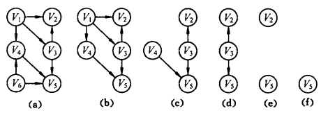

### 2.4. 关键路径

关键路径用于估算工程的最短完成时间。工程进度图示例如下，只有一个起点（入度为0）和一个终点（出度为0），不存在环，关键路径即图中最长路径（权值和最大的路径）。

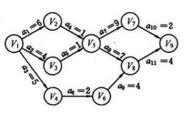

算法步骤为：

1. 从起点出发，求出拓扑排序的序列。
2. 顺拓扑序列，计算各点最早开始时间：当前点最早开始时间 = max(所有入度点最早时间 + 对应边的权值)。
3. 逆拓扑序列，计算各点最晚开始时间：当前点最晚开始时间 = min(所有出度点最晚时间 - 对应边的权值)。
4. 若结点最早开始时间 = 最晚开始时间，则为关键结点，关键结点组成关键路径。
