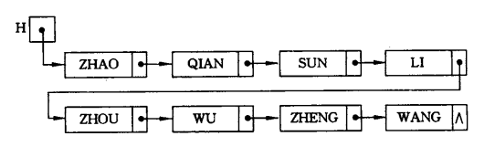
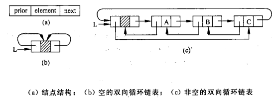
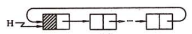

# List

## 1. 概述

连接任意存储单元的线性存储结构。

### 链表的头结点

设计头结点的好处在于：不需要额外考虑第一个结点的插入、删除问题。

### 数组和链表的区别

数组：

- 优点：
  - 存储简单
  - 下标寻址时间复杂度为`O(1)`
- 缺点：
  - 超出当前容量，需要扩展、重新分配空间
  - 插入、删除需要移动后续元素

链表：

- 优点：
  - 插入、删除的时间复杂度为`O(1)`
  - 可在内存范围内无限增长
- 缺点：
  - 指针需要分配额外空间
  - 无法下标寻址

## 2. 扩展

### 双向链表

### 循环链表

## 3. 经典案例

### 链表倒置 - 头插法

思路：采用头插法。**从头到尾依次将结点，插入新链表的头结点之后**，即可实现链表倒置。

示例：[leetcode-92-反转链表II](../../../exercise/leetcode/92反转链表II.cc)

### 一次遍历获取倒数第N个结点 - 双指针

思路：两个指针，第一个指针从头到尾遍历链表，当遍历到第`N+1`个结点时，第二个指针从第`1`个结点开始遍历。**此后，两个指针同步前进，相隔保持`N`个结点**。直到第一个指针到达最后一个`NULL`结点，两个指针停止，此时第二个指针指向倒数第`N`个结点。

示例：[leetcode-19-删除链表的倒数第N个节点](../../../exercise/leetcode/19删除链表的倒数第N个节点.cc)

同样的思路可以解决：

- 返回链表倒数第N个结点
- 旋转链表

参考：[删除链表的倒数第N个节点](https://leetcode-cn.com/problems/remove-nth-node-from-end-of-list/solution/shan-chu-lian-biao-de-dao-shu-di-nge-jie-dian-by-l/)

### 链表判环 - Floyd判圈算法/快慢指针

思路：

**Floyd判圈算法(Floyd Cycle Detection Algorithm)**，又称龟兔赛跑算法(Tortoise and Hare Algorithm)，是一个可以在有限状态机、迭代函数或者链表上判断是否存在环，并求出该环的起点与长度的算法。该算法分为两个阶段：

1. 通过快慢指针，判断是否存在环：

    - 步骤：**慢指针每次前进一步，快指针每次前进两步**。如果链表无环，则快指针将先到达链表结尾；**如果链表有环，快指针将会追上慢指针，并与慢指针在环上的某点相遇**。

    - 原理：慢指针进入环时，快指针与慢指针之间的距离是确定的，而根据相对运动，**两者速度之差为`1结点/次`**，那么经过一定次数之后，距离之差刚好为0。

2. 求环的入口结点：

    - 步骤：两个指针，**指针A指向链表第一个结点，指针B指向第一阶段快慢指针的重合结点**。两个指针同时前进，每次都前进一步。最终，**两个指针相遇的结点，即为环的起点**。

    - 原理：假设链表第一个结点到环入口结点的长度为`a`，环入口到快慢指针重合点的长度为`b`，快慢指针重合点再到环入口点的长度为`c`，则环的长度为`b+c`。且设慢指针走过的路程为`S`，快指针走过的路程为`F`：

      1. 首先，根据第一阶段，我们可以得出：
          - $F = 2S$
          - $S = a + b$
          - $F = a + n(b+c) + b$, $n \geq 1$
      2. 根据上述三式，我们又可以得出：
          - $S = a+b = n(b+c)$
          - 进而：$a = (n-1)(b+c) + c$
      3. 指针A从起点出发，经过$a$步，到达环的入口结点。指针B从重合点出发，经过$(n-1)(b+c) + c$步，也刚好到达环的入口结点。所以，指针A和指针B的重合结点，即为环的入口结点。

示例：[leetcode-142-环形链表II](../../../exercise/leetcode/142环形链表II.cc)

参考：

- [环形链表 II（双指针法，清晰图解）](https://leetcode-cn.com/problems/linked-list-cycle-ii/solution/linked-list-cycle-ii-kuai-man-zhi-zhen-shuang-zhi-/)
- [环形链表 II - leetcode官方](https://leetcode-cn.com/problems/linked-list-cycle-ii/solution/huan-xing-lian-biao-ii-by-leetcode/)

### 合并K个排序链表 - 各显神通

思路：

此题有很多种解法，概括如下：

1. 借用数组进行排序：
    - 步骤：将所有链表中的元素取出，放入一个数组中，**对数组进行快排**，最后根据数组构造一个新链表。
    - 复杂度：
      - 时间复杂度：$O(NlogN)$，快排的时间复杂度。
      - 空间复杂度：$O(N)$，需要新的数组空间。

2. 遍历K个链表首结点，选最小值:
    - 步骤：遍历K个链表的第一个结点，选出最小值的结点，追加到新链表的尾部。
    - 复杂度：
      - 时间复杂度：$O(N \times K)$，遍历链表数组$N$次，数组中有$K$个链表。
      - 空间复杂度：$O(1)$。

3. 方法2的优化，利用 **优先队列（小顶堆）** 找最小值。
    - 步骤：第一次遍历，将所有链表的头结点加入优先队列中。此后，每次从优先队列中 **取出一个元素（取出小顶堆的根结点，最后一个结点上位，并向下筛选）** 追加到新链表中，然后将元素所在链表的下一个结点**加入优先队列中（加入小顶堆的最后，并向上筛选）**，如果没有下一个结点则不加入。如此不断循环，直到优先队列为空，新链表形成。
    - 复杂度：
      - 时间复杂度：$O(NlogK)$，优先队列大小为$K$。
      - 空间复杂度：$O(K)$。

4. 逐个两两合并。
    - 步骤：第1个链表与第2个链表合并，合并后再与第3个链表合并······直到合并完K个链表。
    - 复杂度：
      - 时间复杂度：$O(N \times K)$。**考虑最坏情况**：第1个链表长度为$N-(K-1)$，第2~K个链表长度都为$1$，那么每次合并的复杂度都为$O(N)$，而总共有$K-1$次合并。
      - 空间复杂度：$O(1)$。

5. 归并
    - 步骤：采用分治法，每层分组，每组两个链表，两两合并。例如，最底层分$\frac{K}{2}$组，1和2一组、3和4、5和6······一共有$logK$层。
    - 复杂度：
      - 时间复杂度：$O(NlogK)$，每层总的合并复杂度为$O(N)$，一共有$logK$层。
      - 空间复杂度：$O(1)$。

示例：

- [leetcode-23-合并K个排序链表 - 归并](../../../exercise/leetcode/23合并K个排序链表-归并.cc)
- [leetcode-23-合并K个排序链表 - 优先队列](../../../exercise/leetcode/23合并K个排序链表-优先队列.cc)

参考：[合并K个排序链表 - leetcode官方](https://leetcode-cn.com/problems/merge-k-sorted-lists/solution/he-bing-kge-pai-xu-lian-biao-by-leetcode/)
