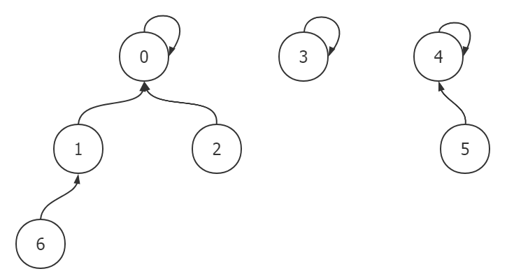
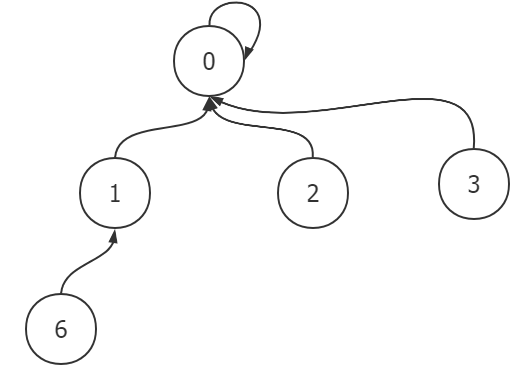
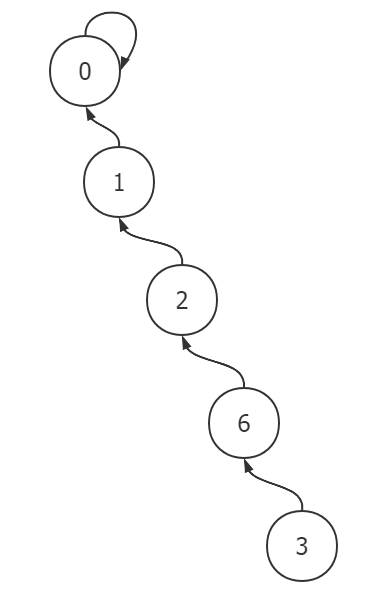

# 并查集

**并查集（Disjoint-set data structure）** 是一种用于管理**一组不相交集合**的数据结构。它使用起来简单有效，每种操作只需几行代码，还可以使用一个简单的数组进行存储。

并查集包含两种主要操作：

- 查询（Find）：查询元素所属的集合。
- 合并（Union）：将两个不相交集合合并为一个集合。

在并查集中，每个集合需要派出一个**代表**，用于识别该集合。

并查集可以用链表或树的结构实现，其中**树结构**更加简洁有效，也更为常用。

每个集合可用一棵树表示，整个并查集则可看作一个不相交的森林。树的根结点作为集合的代表，每个结点都会指向其父结点（根结点指向自己）。示例：有 `0~6` 七个数，其中 `(0,1,2,6)`、`(3)`、`(4,5)` 是三个不相交的集合，用数结构表示如下：



根据树的存储方式可知，可以用数组存储一棵树，而并查集也可以用**数组**存储。

数组的下标 `i` 代表元素，数组的值 `fa[i]` 指向元素 `i` 的父亲（当然，也可以设计结构体，`fa[i].data` 存放数据，`fa[i].fa` 指向父亲）。比如：上述集合 `(0,1,2,6)` 存储到数组中即为 `fa[0] = 0, fa[1] = 0, fa[2] = 0, fa[6] = 1` 。

查询元素 `x` 所属集合的操作，即返回集合代表元素（树的根结点），可顺着 `fa[x] = y, fa[y] = ...` 一直找到根结点 `fa[z] = z` 。

而集合合并操作，可以让集合A的根结点 `x` 指向集合B的根结点 `y` ，即 `fa[x] = y` 。比如合并集合 `(0,1,2,6)` 和 `(3)` 结果如下：



综上，并查集操作的简单代码如下：

```c
int fa[n];

// 初始化：每个元素各成一个集合
void init() {
    for (int i = 0; i < n-1; i++)
        fa[i] = i;
}

// 查询：返回集合的代表元素，即树的根结点
int find(int x)
{
    if(fa[x] == x)
        return x;
    else
        return find(fa[x]);
}

// 合并：将 i 所在集合的根结点指向 j 所在集合的根结点
void merge(int i, int j)
{
    fa[find(i)] = find(j);
}
```

上述代码十分简单易懂，但存在一个问题：查询操作性能会受树高度的影响，当树形似一个链表时，查询性能将非常差。



因此，需要对查询操作进行改进：在查询时进行**路径压缩**，代码如下：

```c
int find(int x)
{
    if(x == fa[x]) {
        return x;
    } else{
        fa[x] = find(fa[x]);  // 将当前结点的父结点设为根结点
        return fa[x];         // 返回父结点，即根结点
    }
}

// 简约版
int find(int x)
{
    return x == fa[x] ? x : (fa[x] = find(fa[x]));
}
```
