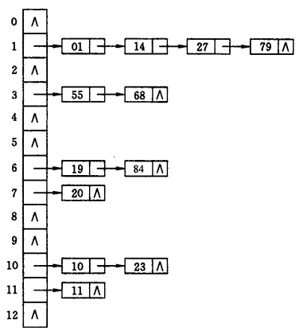

# 散列表 / 哈希表 / Hash Table

查找是现实中出现频率相当高的行为。为了准确查找，通常需要知道被查找东西的 `key` （关键字 / 唯一的标识），比如书的书名、人的名字等等，才能找到对应的数据 `value` 。

同时，查找一直是算法需要解决的一个大问题，许多数据结构和算法的设计都是为提高查找效率，比如：二叉查找树、红黑树、二分查找等等。

在乱序的数组、链表等线性结构中，查找的时间复杂度为 $O(n)$ 。而在二叉查找树等树形结构中，查找的时间复杂度可减小至 $O(logn)$ 。

但是，欲望总是无穷，人们还想在 $O(1)$ 的时间内完成查找。就像数组一样，只要给出数组的下标（`key`），就可以在 $O(1)$ 内找到下标对应的数据（`value`），可数组下标不能无限大、也不只能数字。

**散列表 / 哈希表 / Hash Table** 则是一种期望在 $O(1)$ 时间内完成查找的数据结构，它是**数组**的推广。

散列表通常使用数组进行存储，但它并不直接将数组下标作为 `key` ，而通过**Hash 函数**将 `key` （定义域）转化为数组下标（有限的值域）。

但是 Hash 函数有时可能将不同的 `key` 哈希成同一个结果，这种情况称为 **碰撞/冲突**。

因此在散列表中主要解决两大问题：

- Hash 函数
- 解决冲突

Hash 函数使用的基础 Hash 方法有：

- 加法 Hash
- 乘法 Hash
- 除法 Hash，比如：$H(k) = k mod m$ 。

目前主流的 Hash 函数有：

- MD5
- SHA 系列

这些 Hash 函数一般具有不可逆性，也常用于数据加密。

解决冲突的方法如下：

- 链地址法：key 相同的用链表链接在其后
  
- 开放定址法：
  - 线性探测法：key 相同 -> 放到 key 的下一个位置，$Hi(key) = (H(key) + i) mod m$
  - 随机探测法：$Hi(key) = (H(key) + 伪随机数) mod m$
- 再哈希：冲突则再进行一次哈希 $Hi(key) = H(H(key))$
- 公共溢出区：将冲突的 key 放入溢出区中
