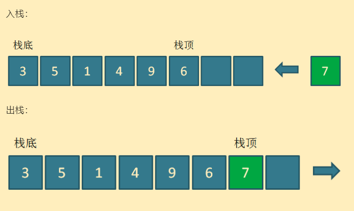
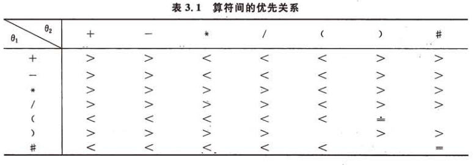

# Stack

## 1. 概述

**先进后出**的数据结构，非常适合**需要从后到前，但只能从前往后**的问题。

存储方式：

- 数组
- 链表

递归的本质是栈，递归可转化为栈。

## 2. 扩展

### 2.1. 单调栈

> 一句话解释单调栈，就是一个栈，里面的元素的大小按照他们所在栈内的位置，满足一定的单调性。

单调栈的思想虽然简单，但应用在具体问题上还是比较困难的。

参考：[刷题笔记6（浅谈单调栈）](https://zhuanlan.zhihu.com/p/26465701)

## 3. 经典案例

### 括号匹配 - 栈的简单应用

思路：创建一个存放括号字符的栈，若栈顶括号与当前括号匹配，则弹出；反之，则压入当前括号。

示例：[leetcode-20-有效的括号](../../../exercise/leetcode/20有效的括号.cc)

### 常规表达式 - 栈的简单应用

思路：

1. 定义两个栈，一个操作数栈，一个运算符栈。运算符栈中，运算符的优先级从低到高。

2. 先用`#`将表达式包裹起来，然后遍历表达式：

    - 如果当前字符是操作数，则压入操作数栈；

    - 如果是运算符，且比栈顶运算符优先级高，则压入栈中；若优先级相等，则弹出栈顶运算符；若比栈顶运算符优先级低，则弹出栈顶运算符，并从操作数栈中弹出两个数，进行运算。然后，将运算结果压入操作数栈中，再继续将当前运算符与栈顶运算符比较，重复上述操作。

3. 为了方便优先级比较，可以事先定义好优先级，栈顶元素为 $\theta_1$，当前元素为 $\theta_2$，如下：

    

4. 遍历表达式直到`#`，与运算符栈顶的`#`运算符抵消，表达式结果为操作数栈顶值。

5. 当然，表达式也可以用递归的方法求解（编译原理）。

示例：[leetcode-224-基本计算器](../../../exercise/leetcode/224基本计算器.cc)

### 逆波兰表达式 - 栈的简单应用

[什么是逆波兰表达式？](https://baike.baidu.com/item/%E9%80%86%E6%B3%A2%E5%85%B0%E5%BC%8F/128437)

思路：

定义一个存放操作数的栈。遍历逆波兰表达式，如果当前字符是操作数，则压栈；如果是运算符，则弹出栈中两个操作数进行运算，再将结果压栈。遍历结束，栈中剩余的数为表达式结果。

示例：[leetcode-150-逆波兰表达式求值](../../../exercise/leetcode/150逆波兰表达式求值.cc)

### 迷宫求解 - 递归转换栈

思路：

迷宫求解可用DFS，对于DFS，可用递归和栈两种方法实现。用栈求解迷宫的过程如下：

1. 定义一个栈，栈中的基本元素为一个结构体，结构体有两个属性，分别是位置和前进方向。

2. 一开始将 出发位置+前进方向0（0表示未确定；1表示上；2表示下；3表示左；4表示右）压栈。

3. 此后，每次获取并弹出栈顶元素，若栈顶元素的前进方向为`i`，则从`i+`开始遍历（前进方向为0，则遍历1~4；前进方向为2，则遍历3~4）。如果某个前进方向可行，则将 当前位置+新的前进方向 和 下一个位置+前进方向0 依次压栈。反之，则啥都不压栈。

4. 如此操作，直至栈为空。

### 八皇后 - 递归转换栈

思路：

八皇后问题可以用递归+回溯的方法轻易求解。每一行遍历所有可行的列，选定一列后，递归操作下一行，直到所有行都已摆好皇后，则算一种解法。由于递归的本质是函数栈的使用，所以，八皇后问题也可以用栈解决。

示例：[leetcode-52-N皇后II](../../../exercise/leetcode/52N皇后II.cc)

### 两个栈实现一个队列

思路：

一个栈A，一个栈B。入队时，将元素压入栈A；出队时，将元素从栈B中弹出。如果栈B为空，则将栈A中元素依次弹出、压入栈B。

示例：[leetcode-232-用栈实现队列](../../../exercise/leetcode/232用栈实现队列.cc)

参考：[漫画：如何用栈实现队列？](https://mp.weixin.qq.com/s/IiOUgS5jZ6pgVqUAJHwNKg)

### 在O(1)时间内获取栈中的最小值 - 单调栈

思想：

- 定义栈为`A`，然后额外创建一个单调栈`B`。单调栈`B`的大小永远跟栈`A`一样，且栈顶代表当前大小下，栈`A`中的最小值。

- 当栈`A`压入一个元素时，用该元素与单调栈`B`栈顶元素比较，如果该元素更小，则压入到单调栈`B`中；反之，则将栈顶元素再压入到栈`B`中。

示例：[leetcode-155-最小栈](../../../exercise/leetcode/155最小栈.cc)

### 柱状图中最大的矩形 - 单调栈

题目：[leetcode - 84 - 柱状图中最大的矩形](https://leetcode-cn.com/problems/largest-rectangle-in-histogram/)

思路：

1. 对于第i个柱子，若要求得以 `heights[i]` 为高的矩形的最大值，我们只需要找到左边第一个小于 `heights[i]` 的柱子 `left_i`，和右边第一个小于 `heights[i]` 的柱子 `right_i`，以 `heights[i]` 为高的矩形的最大值即为：`(right_i - left_i - 1) * heights[i]`。

2. 那么，如何找到 `right_i` 和 `left_i` 呢？可以用单调栈实现：

    - 栈中存放的是柱子的下标 `i`，同时规定栈中的值是根据 `heights[i]` 单调递增的。这样可以保证栈顶前一个值对应的柱子，就是栈顶值对应柱子的 `left_i`。

    - 当新柱子 `j` 的高小于栈顶值 `s.top()` 对应柱子的高时，那么新柱子 `j` 就是栈顶值对应柱子的 `right_i` 了。此时，弹出栈顶值 `k`，以 `heights[k]` 为高的矩形的最大值即为：`(j - s.top() - 1) * heights[k]`。然后，用这个值与柱状图中的最大矩形值比较，如果更大则进行替换。

    - 新柱子继续与当前栈顶值比较，重复上述操作，直到新柱子 `j` 的高大于栈顶值对应柱子的高，则 `s.push(j)`，并 `j++` 指向下一个新柱子。

    - 最后，如果栈中还存在剩余，则说明剩余柱子不存在 `right_i`，那么以它们柱子的高 `heights[i]` 为高的矩形的最大值即为：`(heights.length() - left_i - 1) * heights[i]`。

示例：

- [leetcode-84-柱状图中最大的矩形-单调栈](../../../exercise/leetcode/84柱状图中最大的矩形-单调栈.cc)
- [leetcode-85-最大矩形](../../../exercise/leetcode/85最大矩形.cc)

参考：

- [官方题解](https://leetcode-cn.com/problems/largest-rectangle-in-histogram/solution/zhu-zhuang-tu-zhong-zui-da-de-ju-xing-by-leetcode/)

- [找两边第一个小于它的值](https://leetcode-cn.com/problems/largest-rectangle-in-histogram/solution/zhao-liang-bian-di-yi-ge-xiao-yu-ta-de-zhi-by-powc/)
