# Tree

## 1. 概述

树是一种非常重要的非线性数据结构。

- 没有父结点的为根结点，没有孩子结点的为叶子结点。
- 不存在环路。
- 边的数量 = 结点数量 - 1 。

### 二叉树

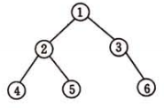

每个结点至多有两颗子树（多个孩子）。

性质：

1. 第 i 层至多有 $2^{i-1}$ 个结点。
2. 深度为 k 的二叉树至多有 $2^k-1$ 个结点。
3. 若度为 0 结点（叶子结点）数为 $n_0$ ，度为 2 结点（有两个孩子的结点）数为 $n_2$，则 $n_0 = n_2 +1$ 。

特殊形态：

- 满二叉树：深度为 k 且有 $2^k-1$ 个结点的二叉树。
  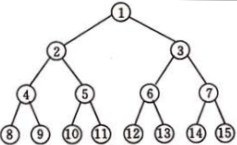

- **完全二叉树**：对二叉树中的结点按从上至下、从左到右的顺序进行编号，当且仅当深度为 k 的二叉树，其每个结点的编号都与深度为 k 的满二叉树的结点编号一一对应时，才是完全二叉树。
  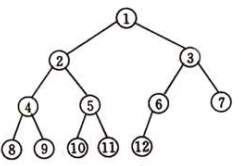

存储方式：

- 链式。结点通过指针相连，每个结点包含左右孩子指针，还可以包含父指针。
  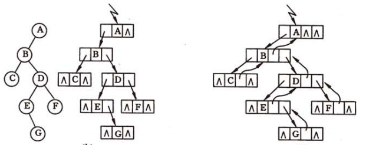
- 数组。结点通过数组存储，通过编号索引结点，**仅适用于完全二叉树**。

遍历：

- 先中后序遍历使用**递归**或**栈**。
- 层次遍历使用**队列**。

### 树 / 多叉树

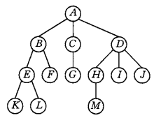

每个结点可以有多个子树。

存储方式：

- 数组：双亲（父亲）表示法。结点通过数组存储，结点中包含父结点下标。
  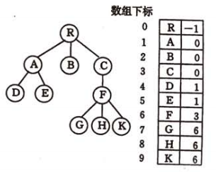
- **数组 + 链式：孩子表示法**。结点通过数组存储，结点中包含指向孩子链表的指针，还可以包含父结点的下标。**优点是可通过下标快速索引**。
  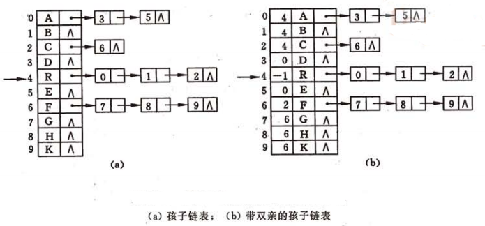
- **链式：孩子兄弟表示法/二叉树表示法**。结点中包含指向第一个孩子结点和下一个兄弟结点的指针，当然也可以包含父结点指针。
  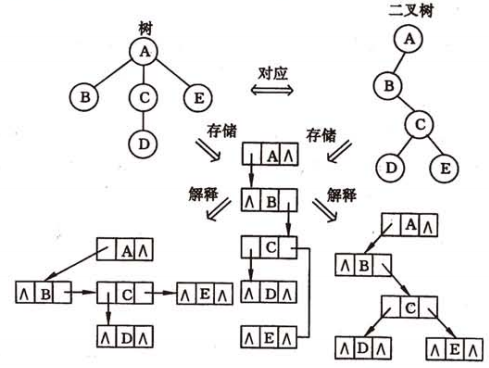

采用二叉树表示法，遍历等操作与二叉树相同。

## 2. 扩展

### 堆

**堆**是一棵完全二叉树，根据堆排序的特性，堆可分为两类：

- 大顶堆 / 最大堆：结点的值一定大于左右孩子结点的值，堆顶（根结点）是最大值。
- 小顶堆 / 最小堆：结点的值一定小于左右孩子结点的值，堆顶（根结点）是最小值。

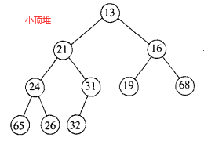

由于堆是完全二叉树，可以用**数组**存储，且不需要指针。对堆中的结点按从上至下、从左到右的顺序进行编号，编号即对应数组下标，对于数组中下标为 `i` 的位置，其左右孩子分别在 `2*i + 1` 和 `2*i + 2` 位置。

堆并不擅长查询操作，可用树遍历的方式进行查询。

堆插入结点 `X`：

1. 将结点添加到堆的最后（数组尾部）；
2. 然后进行**上滤**操作（假设是**小顶堆**）：若结点 `X` 的值小于其父结点的值，则与父结点交换位置；重复操作，直至结点 `X` 的值不小于其父结点的值或到达根结点。

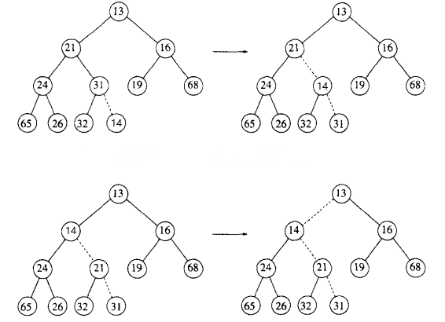

堆删除**堆顶结点**：

1. 将堆最后的结点 `X` 放置到堆顶；
2. 然后进行**下滤**操作：（假设是**小顶堆**）：将左右结点中**值最小**的结点 `Y` 与 `X` 比较，若 `Y` 的值较小，则与 `Y` 交换位置；重复操作，直至无法交换或到达叶子结点。

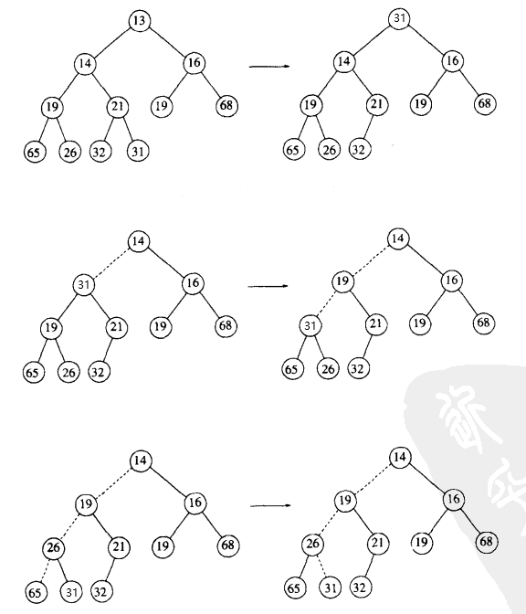

### Huffman 树

**赫夫曼（Huffman）树**，又称最优树，是一种带权路径最短的树，在编码方面有着重要的应用。

存储方式为：数组。

算法步骤：

1）建树：初始化 Huffman 数组后（每个结点都有权重）。遍历数组，取出权重最小的两个“结点”变为新结点的左右孩子，并算出新结点的权重，将新结点加入到数组。重复上述操作，直到所有初始结点都有父结点。

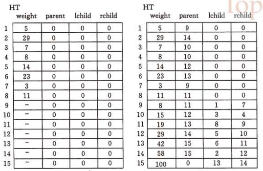

2）编码：从每个叶子往头结点遍历，若当前结点是左孩子则将0压入栈，若是右孩子则将1压入栈，最后将栈输出即是编码。

3）解码：遍历Huffman码，从Huffman树的头结点开始，若是0则到左孩子，是1则到右孩子，重复该操作直到Huffman码遍历完。

### 二叉查找树 / 二叉排序树

二叉查找树，又称二叉排序树，是指一棵空树或者具有下列性质的二叉树：

1. 若它的左子树不空，则左子树上所有结点的值均**小于**它的根结点的值；
2. 若它的右子树不空，则右子树上所有结点的值均**大于**它的根结点的值；
3. 它的左、右子树也分别为二叉查找树；
4. 不存在值相等的结点

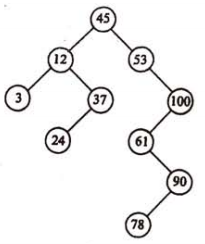

在二叉查找树中**查找**一个数 `x` ，有如下步骤：

- 若当前树是空树，则搜索失败；
- 若 `x` 等于当前树根结点的值，则查找成功；
- 若 `x` 小于当前树根结点的值，则递归查找左子树；
- 若 `x` 大于当前树根结点的值，则递归查找右子树。

在二叉查找树中**插入**一个值为 `x` 的结点（新插入结点一定是叶子结点），有如下步骤：

- 若当前树是空树，则将新结点作为根结点插入；
- 若 `x` 等于当前树根结点的值，则返回失败；
- 若 `x` 小于当前树根结点的值，则递归插入左子树；
- 若 `x` 大于当前树根结点的值，则递归插入右子树。

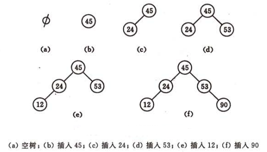

在二叉查找树中**删除**值为 `x` 的结点，有如下步骤：

- 首先，需成功查找到值为 `x` 的结点，并获得指向该结点的指针 `p` ，以及其父结点的指针 `f`。
- 其次，删除 `*p` 结点需分三种情况：

    1. `*p` 为叶子结点，直接删除。
    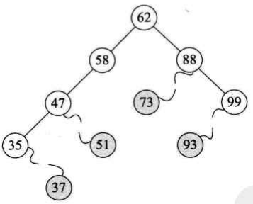
    2. `*p` 只有左子树或右子树，则只需让左子树或右子树代替 `*p` 即可。
    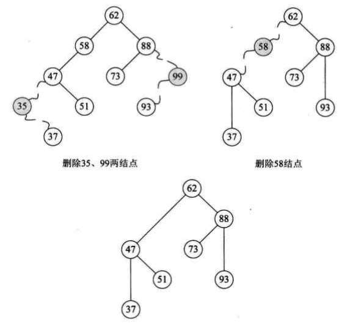
    3. `*p` 左右子树均不为空，则需找到**前驱结点**（左子树中值最大的结点，即**左子树的最右结点**）或**后继结点**（右子树中值最小的结点，即**右子树的最左结点**） `*s` 。然后分两种做法：
    1）删除 `*s` （**满足情况2**），并将其替换到 `*p` 结点的位置。
    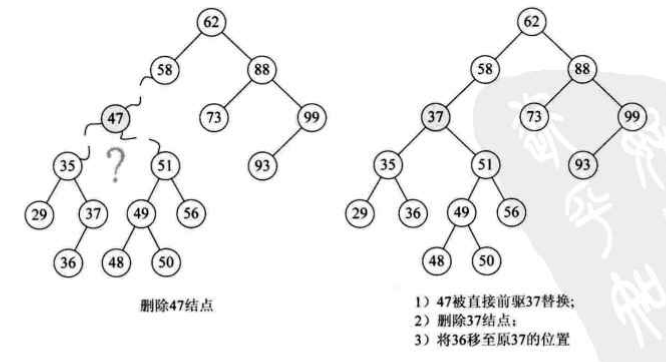
    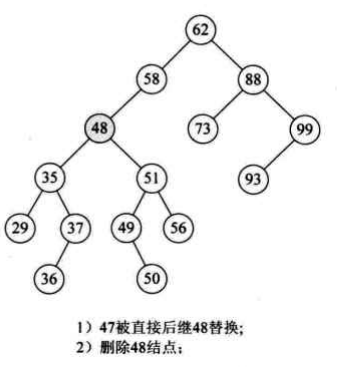
    2）将 `*p` 结点的右子树变为前驱结点的右子树，或者左子树变为后继结点的左子树，再删除 `*p` （满足情况2）。
    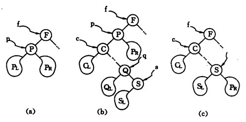
    **注：第一种做法更好，对树的平衡性破坏小**。

二叉查找树在查询方面有着高性能：当左右子树深度相差较小时，查找性能最佳，时间复杂度是 $O(logn)$ ；但当近似线性结构时，查找性能最差，时间复杂度是 $O(n)$：

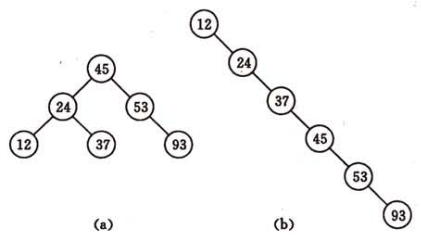

参考：

- 《数据结构（C语言版）》-严蔚敏
- 《大话数据结构》

### 平衡二叉树 / AVL 树

由于二叉查找树最坏情况出现概率较大，十分影响查找性能，往往需要进行平衡操作，因此平衡二叉树得以出现。

平衡二叉树又称AVL树，是指一棵空树或者具有下列性质的二叉树：

1. 左右子树都是平衡二叉树。
2. 左右子树的深度差的绝对值不超过1。将该结点的**左子树深度减去右子树深度**定义为**平衡因子（BF）**，平衡二叉树上所有结点的BF值只可能是-1、0、1。

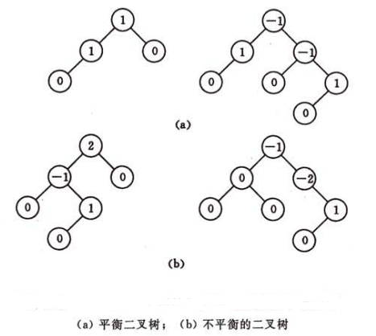

平衡二叉树在插入、删除结点后，平衡性可能会被破坏，需要进行**平衡化操作**。

平衡化操作准备阶段：

- 在插入和删除结点后，需要更新结点的高度（从下往上叫高度），计算平衡因子。为了提高效率，可将高度作为结点属性，插入/删除结点后**反向沿途**更新。

- 然后，对**失去平衡的最小子树**（其根结点为离插入/删除结点最近且平衡因子绝对值大于 1 的祖先结点）进行平衡操作。为了找到最小子树，需**反向沿途**查找。

**注：反向沿途并不需要指向父结点的指针，只需利用递归特性（前->后->前）即可**。简单伪代码如下：

```c++
// C
typedef Node* NodePtr;

int getH(NodePtr root) {
  if (root == NULL) return 0;
  return root->height;
}

void insert(NodePtr &root, int value) {
  ...
  // 递归终止条件
  if (root == NULL) {
    root = malloc(sizeof(Node));
    root->data = value;
    root->left = root->right = NULL;
    root->height = 1;
    return;
  }
  ...
  // 递归具体过程：
  // 先插入/删除结点；
  // 更新并记录高度值；
  // 计算平衡因子；
  // 若平衡被破坏，则进行平衡操作。
  insert(&root->left, value);
  root->height = max(getH(root->left), getH(root->right)) + 1;
  int factor = getH(root->left) - getH(root->right);
  if (factor > 1 || factor < -1) rebalance(root);
  ...
}
```

平衡操作主要通过旋转，设失去平衡的最小子树的根结点指针为 `a` ，可分为 4 种情况：

- 插入结点在 `*a` 左孩子的左子树处（**LL型**），`*a` 的平衡因子由 1 增至 2 ，则需进行一次**右旋**操作：
  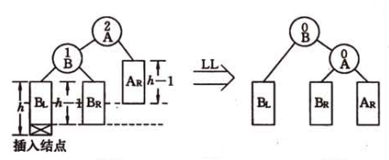
- 插入结点在 `*a` 右孩子的右子树处（**RR型**），`*a` 的平衡因子由 -1 增至 -2 ，则需进行一次**左旋**操作：
  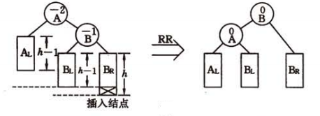
- 插入结点在 `*a` 左孩子的右子树处（**LR型**），`*a` 的平衡因子由 1 增至 2 ，则需进行 **先左旋后右旋（B左旋A右旋）** 操作：
  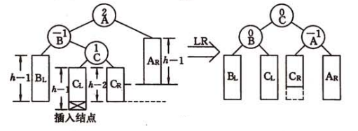
- 插入结点在 `*a` 右孩子的左子树处（**RL型**），`*a` 的平衡因子由 -1 增至 -2 ，则需进行 **先右旋后左旋（B右旋A左旋）** 操作：
  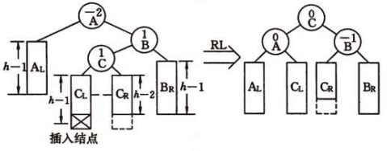

**注：平衡二叉树的初衷就是建立在二叉查找树之上的。因此平衡操作并不会改变二叉查找树的排序性，也不会影响插入删除操作，只会在插入删除后维持平衡**。

参考：

- 《数据结构（C语言版）》-严蔚敏
- [详解 AVL 树（基础篇）](https://zhuanlan.zhihu.com/p/34899732)

### 红黑树

平衡二叉树能很好地保持二叉排序树的平衡性，使其拥有更好的查询性能。但是，平衡二叉树插入删除维护代价较大，性能并不乐观。因此，红黑树应运而生。

红黑树是一种包含如下性质的二叉查找树：

1. 每个结点要么是红的，要么是黑的。
2. 根结点是黑的。
3. 每个叶结点（NIL）是黑的（叶结点不存放数据）。
4. 如果一个结点是红的，那么它的俩个孩子都是黑的。
5. 对于任一结点，从该结点到其子孙结点的所有路径上都包含相同数目的黑结点。

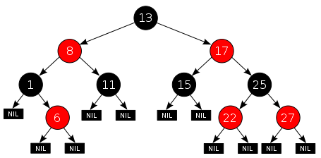

根据性质 4 ，路径上不可能存在两个相连的红色节点，最短的路径可能都是黑色结点，最长的路径可能有交替的红色和黑色结点。又结合性质 5 ，可以推出**没有路径能多于任何其他路径的两倍长**，因而红黑树是**接近平衡**的。

红黑树可以在 $O(logn)$ 时间内完成查找、插入和删除。相对于AVL树来说，红黑树牺牲了部分平衡性以换取插入/删除性能，整体来说性能要优于AVL树。

红黑树操作较为复杂，暂缓。

参考：

- 《算法导论》
- [红黑树 - wiki](https://zh.wikipedia.org/wiki/%E7%BA%A2%E9%BB%91%E6%A0%91)

### B- 树 / B 树

B- 树是一种平衡的多路查找树，主要用于磁盘读写场景，比如文件存储、数据库索引。

一棵 m 阶的 B- 树具有以下性质：

1. 每个结点至多有 m 个子树。
2. 若根结点不是叶子结点，则至少有 2 个子树。
3. 除根结点外，所有非叶子结点至少有 $\lceil m/2 \rceil$ 个子树。
4. 每个结点包含如下信息（**结点 `key` 值个数 = 子树个数 - 1**）：
  $(n, P_0, K_1, P_1, K_2, P_2, ..., K_n, P_n)$
  $n$ 是结点中 `key` 的个数；
  $K_i(i=1,2,...,n)$ 是用于排序的 `key` 值，且 $K_i < K_{i+1}$；
  $P_i(i=0,1,...,n)$ 是指向子树根结点的指针，且 $P_i(i=0,1,...,n-1)$ 指向子树中所有结点的 `key` 值**都小于** $K_{i+1}$ ， $P_n$ 指向子树中所有结点的 `key` 值**都大于** $K_n$ 。
5. 所有叶子结点都在同一层。

如下是一棵 3 阶的 B- 树：

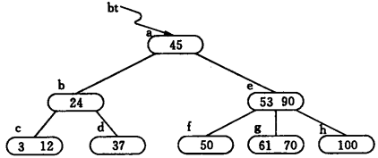

在 B- 树中**查找**一个 key 值 `x` 的操作如下：

- 若当前树为空，则查找失败；
- 遍历当前树根结点中的 $K_i$，若存在 $K_i == x$ ，查找成功；若不存在，则递归查找对应的子树，比如 $x < K_1$ 则递归查找 $P_0$ 指向的子树。

在 B- 树种**插入**一个 key 值 `x` 的操作如下：

- 若插入结点 key 个数小于 m-1 ，则直接插入；
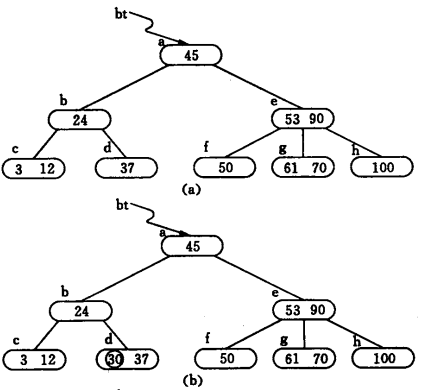
- 否则，**分裂并将多余的交给父结点**：根据中间的 key 将结点分为左右两个结点，并将中间 key 插入到父结点中。若父结点也出现多余，则**递归**插入父结点的父结点，直至形成新的根结点。
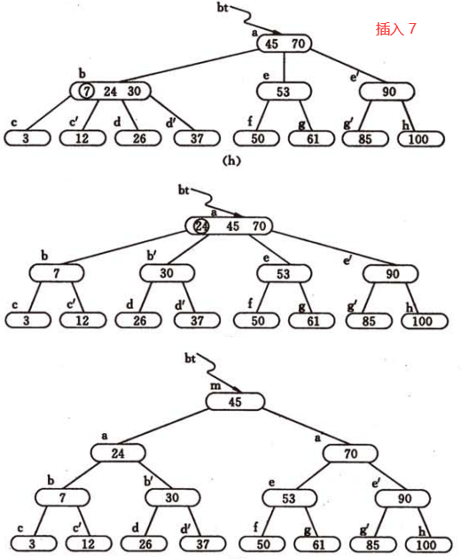

在 B- 树中**删除**一个 key 值的操作如下：

- 若在非叶子结点，删除 key 值后需找前驱或后继 key 值代替之，比如：删除 $K_i$ ，可以找 $P_i$ 指向的子树中的最小 key 值（一定在叶子结点的最左端），删除它（**需采用如下叶子结点删除 key 的 3 种方法**），并替代到 $K_i$ 位置上。
- 若在叶子结点，则分 3 种情况：
  - 结点中 key 个数大于或等于 $\lceil m/2 \rceil$，则直接删除；
  - 否则，**跟相邻的右兄弟/左兄弟结点借**：将兄弟结点中最小（最大）的 key 上移到父结点中，将父结点中小于（大于）且紧邻的 key 下移至当前结点；
  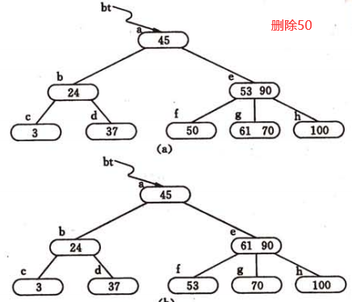
  - 若兄弟结点也不够（key 个数都小于 $\lceil m/2 \rceil$），则**跟父结点借并于兄弟合并**：设父结点中 $P_i$ 指向当前结点，则将父结点中 $K_{i+1}$ 或 $K_{i}$ 下移，当前结点跟相邻的右结点或左结点合并。若借完，父结点中 key 个数小于 $\lceil m/2 \rceil$ ，则**递归**向父结点的父结点借，直至根结点。
  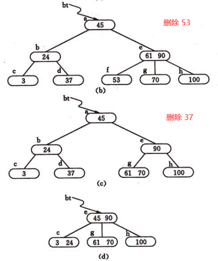

虽然 B- 树的查找性能不如平衡的二叉查找树或红黑树，但是 B- 树更符合磁盘读写规则，应用于磁盘读写场景性能更加。

磁盘读写以块为单位（512KB），二叉查找树每个结点只能存放一个单位数据，数据量较小，一同读取的块内其它数据几乎是无用的。而且结点存储离散分布，可能查找过程中经过的结点都分布在不同的块中，会引起**频繁的磁盘读写**。

而 B- 树一个结点可存放大量数据，可填充满一至多个块，这样每次读取的块内数据都是有用的。同时，相同数据量，B-树结点更少、高度更小，意味着查找过程中经过的结点数量少，磁盘读写次数少。而**磁盘读写次数常常是影响性能的关键**。

参考：

- 《数据结构（C语言版）》-严蔚敏
- [面试官问你B树和B+树，就把这篇文章丢给他](https://segmentfault.com/a/1190000020416577)

### B+ 树

B+ 树是应文件系统所需而诞生的 B- 树的变型版本，MySQL中 InnoDB 引擎的索引结构即是 B+ 树。

B+ 树与 B- 树的差异在于：

1. 结点 `key` 值个数 = 子树个数；
2. 所有叶子结点中包含全部 `key` 值，及指向对应 `value` 数据的指针；
3. 叶子结点之间根据 `key` 值从小到大连接起来，形成一个**链表**；
4. 所有非叶子结点只做索引，仅包含子树中的最大（或最小） `key` 值。

如下是一棵 3 阶的 B+ 树：

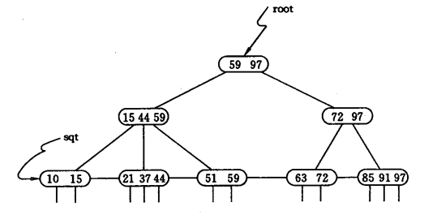

B+ 树的查找、插入、删除操作与 B- 树类似。不同在于：

- 查找：若在非叶子结点上查找到相同值并不终止，而要继续，直到叶子结点；
- 插入：只在叶子结点上插入，若分裂，则需将两个新结点的最大（或最小）key 值更新到父结点中；
- 删除：只在叶子结点上删除，若不够跟兄弟借，若兄弟不够直接跟兄弟合并，并更新父结点。

B+ 树相对于 B- 树的优势在于：

1. 顺序遍历、范围遍历更加方便；
2. 查询效率更加稳定（每条查询路径都要到达叶子结点）
3. 结点可以只存放 key 值，不存放数据，一个结点可容纳更多的单位数据，树更加“矮胖”。

参考：

- 《数据结构（C语言版）》-严蔚敏

## 3. 经典案例
